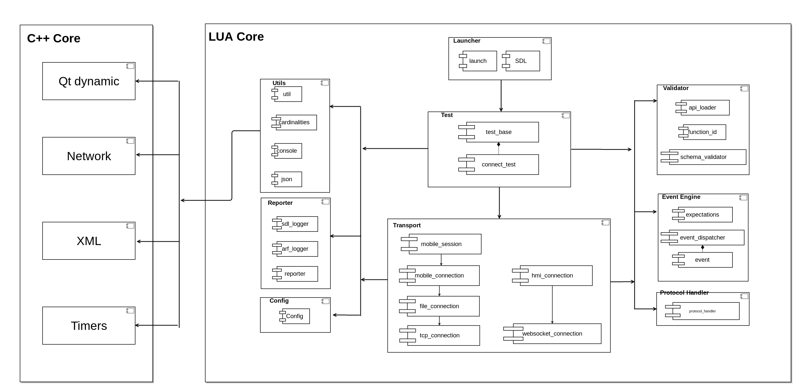

#ATF components overview
This  documents provide short descriptions of main ATF components.
Components diagram:

## C++ Core
C++ Core runs lua core.
C++ core contains common utils functions like:

- timer
- Qt signal/slot system 
- XML parsing
- Web-Sockets
- Tcp-Sockets

## Lua core

Lua core contains main functionality of ATF.

### Utils

Contains common utils used in ATF like

- json encoder/decoder
- console output formater
- arguments parser 

### Reporters

Contains components for ATF output reports. There 3 main ATF outputs

#### SDL logger

Grabs SDL log via telnet and save it to corresponding directory. 
*Logs provided in plain text format*

#### ATF logger 

Grabs all transport data, parse according ford protocol and save to simplify analyzing transferred data.
*Logs provided in plain text format*

#### XML reporter

Provide reports of ATF scripts execution contains all received and expected requests, information about fails to analyze it. 
*Logs provided in XML format*

### Launcher

Contains logic run and stop SDL it use lua script to handle SDL state during scripts execution and bash scripts to run and stop SDL.

### Event engine

Provide functionality for basic event engine and common expectation

### Config

Contains configurable data for ATF run.
*Config is lua script with name = value paramaters*

### Transport

Components used to provide specific transport in ATF

#### TCP connection

Provide ability to connect to remote host and transfer TCP data.

#### Web-socket connection

Provide ability to connect to remote host and transfer web-socket data.

#### HMI connection 

Use web-socket connection to transfer json requests/responses

#### File connection

Used as socket abstraction for mobile connection to prevent  memory overflow.
This component writes to file system all data that it received. And write to socket when socket is ready.

### Mobile Connection

Implements logic of receiving/sending mobile requests/responses 

### Validation

This components use HMI and mobile API to validate input and output data.

### Protocol handler 

Used to validate and parse mobile data on protocol layer. Used by mobile connection. 

#### Mobile Session 

Implements all session logic:
- Requests/responses handling
- Heart beet
- Session multiplexing
- Open/close session

